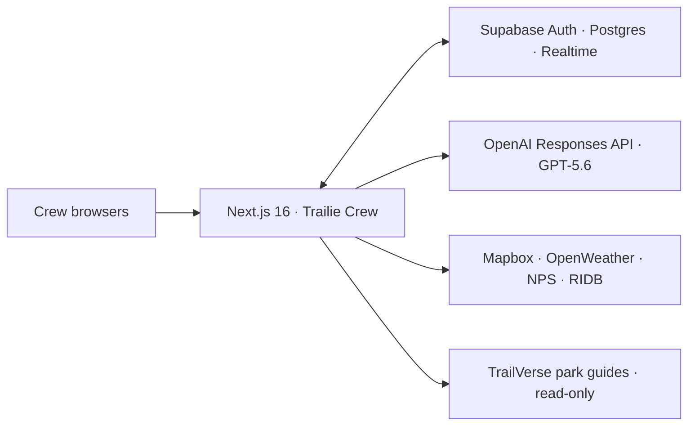

# Trailie Crew

> **Plan trips together. Ask Trailie when you need help.**

Trailie Crew is a conversation-first collaborative AI trip planner built for **OpenAI Build Week 2026** in the **Apps for Your Life** category. Friends plan in one shared space, bring Trailie into the conversation only when needed, approve the plan together, and keep every published itinerary version trustworthy and shareable.

[Marketing site](https://trailiecrew.com) · [Open the app](https://app.trailiecrew.com) · [Create a Trip](https://app.trailiecrew.com/create) · [Join a Trip](https://app.trailiecrew.com/join)

## Why Trailie Crew

Group travel planning usually gets fragmented across chats, notes, links, polls, and spreadsheets. The hardest part is not generating a list of attractions—it is maintaining shared context, understanding what the group actually agreed on, and turning that agreement into a plan without letting an assistant take over.

Trailie Crew gives the group a durable shared conversation. Ordinary messages remain ordinary chat. Mention `@Trailie` anywhere in normal prose when the crew wants focused help, then explicitly move into planning only when everyone is ready.

## What it does

- **Shared Realtime Trips** — create a private Trip, invite the crew, see presence and typing activity, reply, react, and keep a persistent conversation across devices.
- **Trailie on demand** — `@Trailie` works at the beginning, middle, or end of ordinary prose. Deterministic application code ignores mentions inside code, quotes, email-like text, escaped text, and longer handles such as `@TrailieCrew`.
- **Private conversation understanding** — eligible human messages can be converted into bounded private preferences, constraints, corrections, decisions, and open questions without generating extra chat messages.
- **Crew-approved planning** — Trailie prepares a structured “Before I build the trip” summary. The application—not the model—decides readiness, staleness, and whether the required crew approvals are complete.
- **Validated itineraries** — approved summaries can become structured itineraries with travel evidence, deterministic validation, one bounded repair, and PASS-only publication.
- **Safe revisions and history** — requested changes are analyzed against an immutable base version, approved by the crew, scope-checked, and published as a new version without changing the old one.
- **Maps, sharing, and exports** — explore a version-aware itinerary map, share an exact read-only version, download an RFC 5545 calendar, or use the print view to save a PDF.
- **Evidence-aware answers** — current weather, routes, park information, hours, reservations, and alerts are treated as verified, stale, conflicting, estimated, or unavailable instead of being silently invented.

## 60-second demo

1. Create a Trip and copy the private invitation.
2. Join from a second browser or device and exchange ordinary Realtime messages.
3. Type `Let’s ask @Trailie what do you think?` and watch Trailie respond in the shared conversation.
4. Open **Plan**, build the planning summary, and approve it as a crew.
5. Generate the itinerary; Trailie’s output must pass application-owned validation before publication.
6. Request and approve a change to create Version 2 while Version 1 remains immutable.
7. Share, print, or export the exact published version you selected.

## Part of the TrailVerse ecosystem

**TrailVerse** is the national-parks discovery and exploration ecosystem. **Trailie Crew** is its collaborative group-planning surface: TrailVerse helps travelers explore parks, while Trailie Crew helps a group discuss choices, reach decisions, and turn those decisions into an approved trip.

[Explore TrailVerse](https://www.nationalparksexplorerusa.com)

The relationship is intentionally safe and loosely coupled:

- Verified official NPS evidence can deterministically unlock an allowlisted TrailVerse park guide.
- Official provider evidence always takes precedence over curated TrailVerse mappings.
- The model cannot invent or select a TrailVerse link; application code derives it from a verified NPS park code.
- Trailie Crew and TrailVerse keep separate repositories, deployments, and databases.
- Future park-knowledge access stays behind the read-only `@trailie/trailverse-adapter` contract or an equivalent stable API. Trailie Crew never writes directly to TrailVerse data.

## Architecture



The browser receives only public configuration and authorized room data. Authentication, provider credentials, private memory, model calls, travel-provider calls, validation, and publication remain behind server or database boundaries.

## Built with Codex and GPT-5.6

Trailie Crew was built as a human + Codex collaboration. Human direction defined the product, experience, trust boundaries, scope, and final decisions. Codex translated those decisions into a production deployment through test-first implementation, database migrations, security reviews, failure diagnosis, browser verification, and release hardening.

### How Codex was used

Codex helped build and verify the complete product path:

- Next.js, TypeScript, workspace, design-system, and CI foundations
- Supabase schema, RPC, RLS, Realtime, invitation, and lifecycle boundaries
- responsive multi-user chat, presence, mentions, replies, reactions, and optimistic reconciliation
- focused Trailie streaming, silent memory, approval-gated planning, itinerary generation, and revisions
- strict schemas, deterministic validators, durable provider attempts, quotas, recovery, and safe failures
- version-pinned sharing, calendar export, print/PDF, evidence rendering, and interactive maps
- Vitest, React Testing Library, pgTAP, Playwright, provider acceptance, and production debugging
- Vercel domains, environment contracts, deployment verification, and runtime-log investigation

The detailed human/Codex development record is in the [Codex collaboration log](docs/build-week/codex-collaboration-log.md).

### How GPT-5.6 was used

All model-backed paths use the OpenAI Responses API through pinned `openai@6.46.0`, strict structured outputs, `store: false`, bounded context, HMAC safety identifiers, explicit timeouts, and application-owned routing.

| Role                              | Exact model                      | Responsibility                                                             |
| --------------------------------- | -------------------------------- | -------------------------------------------------------------------------- |
| Focused crew answers              | `gpt-5.6-terra`                  | Fast, explicit `@Trailie` questions and narrow analysis                    |
| Silent conversation memory        | `gpt-5.6-luna`                   | High-volume private extraction that never creates chat output              |
| Planning and itinerary generation | `gpt-5.6-sol`                    | Approval-gated summaries, multi-constraint itineraries, and bounded repair |
| Revision analysis                 | `gpt-5.6-terra` or `gpt-5.6-sol` | Deterministic routing sends complex or high-impact changes to Sol          |

GPT-5.6 does **not** decide who may access a Trip, whether a mention invokes Trailie, which tools are permitted, which model runs, whether the crew approved, whether an itinerary passed validation, or whether a plan is published. Those decisions remain in deterministic TypeScript and PostgreSQL code.

See [model routing](docs/build-week/model-routing.md) and the [OpenAI integration](docs/build-week/openai-integration.md) for the exact request shapes and model boundaries.

## Trust and safety by design

- Anonymous Supabase identities provide real authenticated JWTs without requiring personal information for the demo flow.
- Room membership and ownership are enforced with PostgreSQL RLS and authorization-aware RPCs.
- Invite and share tokens are high-entropy; persisted share tokens are SHA-256 hashes rather than reusable raw secrets.
- Trailie is silent unless deterministic invocation or an explicit application action calls it.
- Provider keys, private memory, model context, and administrative credentials never ship to the browser.
- AI output is parsed through strict versioned schemas before rendering or persistence.
- Application validators—not model confidence—control itinerary publication.
- Public plans are version-pinned, privacy-redacted, read-only, non-indexed projections that fail closed after expiration or revocation.
- Operational logs use bounded metadata and recursive redaction rather than message bodies, prompts, tokens, or private memory.

## Technology stack

- Next.js 16 App Router, React 19, and strict TypeScript
- Tailwind CSS 4, Geist Sans, and Geist Mono
- pnpm workspaces with typed `@trailie/*` packages
- Supabase Auth, PostgreSQL, Realtime, RLS, and RPC-only sensitive writes
- OpenAI Responses API with GPT-5.6 Terra, Luna, and Sol
- Mapbox, OpenWeather, National Park Service, and RIDB provider adapters
- Vercel production deployment and environment management
- Vitest, React Testing Library, jsdom, Playwright, and pgTAP
- ESLint, Prettier, and GitHub Actions

## Repository map

```text
src/app                         Next.js routes, pages, and API boundaries
src/features                    Chat, Trailie, planning, itinerary, revisions, maps, sharing
src/server                      AI, Supabase, travel providers, operations, validation
packages/schemas                Shared versioned domain contracts
packages/travel-tools           Provider-neutral travel evidence tools
packages/trailverse-adapter     Read-only TrailVerse knowledge boundary
supabase/migrations             Database schema, RPC, RLS, and lifecycle migrations
supabase/tests                  pgTAP authorization and workflow tests
e2e                             Multi-browser Playwright acceptance scenarios
docs/build-week                 Product decisions and implementation evidence
docs/production                 Environment, security, provider, and operations runbooks
```

## Local development

### Prerequisites

- Node.js 22 or newer
- pnpm 10
- Docker-compatible container runtime
- Supabase CLI and PostgreSQL client tools for database acceptance tests

### Start locally

```bash
pnpm install
pnpm exec supabase start
pnpm exec supabase db reset
pnpm dev:local
```

The local development and browser-test paths use deterministic external-provider adapters by default. Real OpenAI or travel-provider requests require the server-only variables documented in [`.env.example`](.env.example). Never expose a secret through a `NEXT_PUBLIC_*` variable.

### Quality gates

```bash
pnpm lint
pnpm typecheck
pnpm test
pnpm build:local
pnpm exec supabase test db
pnpm test:e2e
```

Additional opt-in smoke and acceptance commands are documented in `package.json` and the provider runbooks.

## Current boundaries

Trailie Crew helps a group research and plan; it does not book or purchase travel. Live prices, inventory, operating conditions, weather, routes, permits, and reservations can change and must remain visibly sourced or marked unavailable. Browser print provides Save as PDF; the app does not claim a separately generated server PDF artifact.

The deployed hackathon experience is live, but that does not imply professional legal review, paid backup/PITR, guaranteed provider availability, or complete assistive-technology certification. Operational and provider limitations remain documented rather than hidden.

## Documentation

- [Architecture](docs/build-week/architecture.md)
- [Product specification](docs/build-week/product-spec.md)
- [Codex collaboration log](docs/build-week/codex-collaboration-log.md)
- [GPT-5.6 model routing](docs/build-week/model-routing.md)
- [OpenAI integration](docs/build-week/openai-integration.md)
- [Trailie invocation contract](docs/build-week/trailie-invocation.md)
- [Database security](docs/build-week/database-security.md)
- [Travel provider inventory](docs/production/travel-provider-inventory.md)
- [Production environment contract](docs/production/environment-variables.md)
- [Operations and release runbooks](docs/production/)

## Submission

Trailie Crew demonstrates a practical model for human-centered AI collaboration: the group owns the conversation and the decisions, GPT-5.6 contributes structured intelligence when asked, and deterministic application code keeps authority over data, tools, approvals, validation, and publication.
